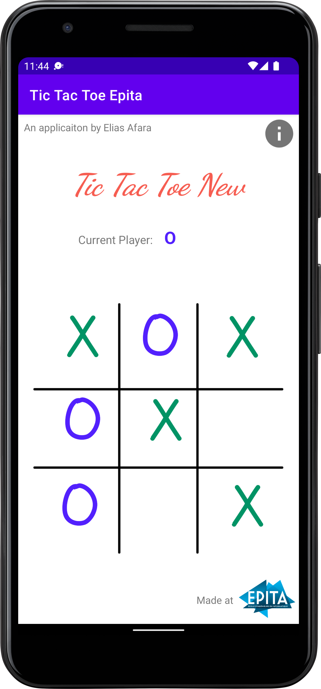
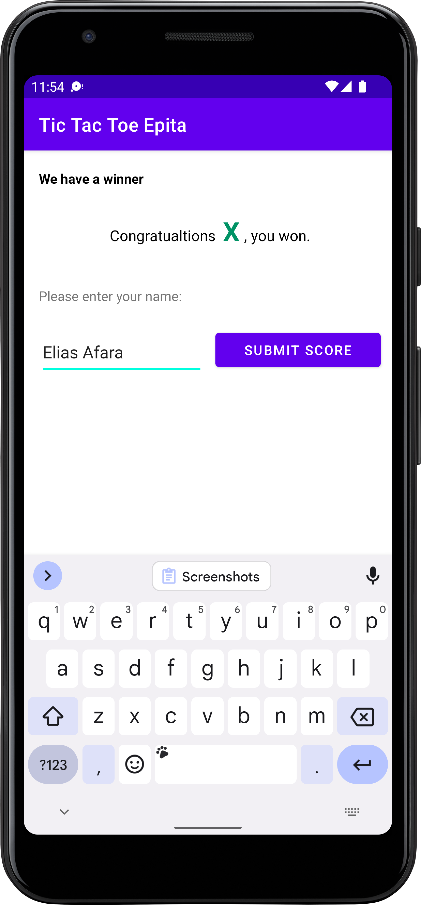
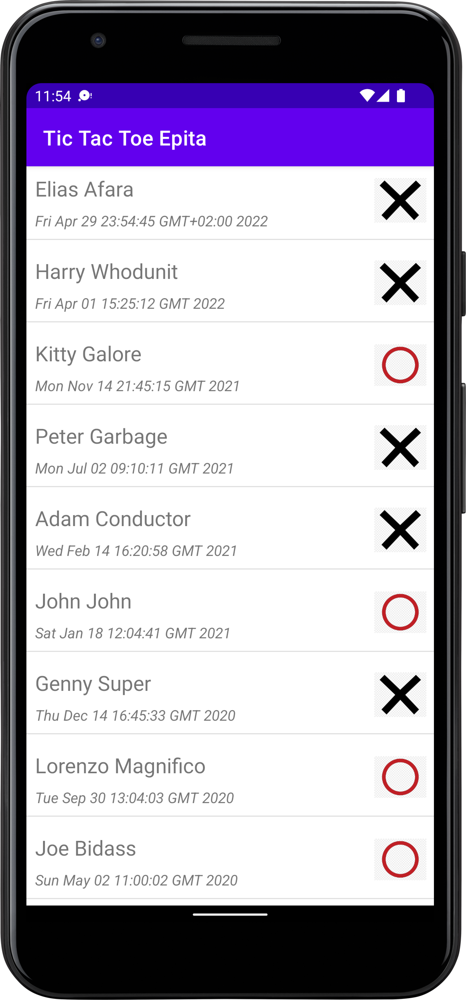

<p align="center">
    
</=>


# Tic Tac Toe Game - Android Application

<p align="center">
    <a href="https://www.android.com" alt="Android" target="_blank">
        </a>
    <a alt="LICENSE">
        </a>
    <a href="https://github.com/EliasAfara/TicTacToe-Android" target="_blank">
        </a>
    <a href="https://github.com/EliasAfara" target="_blank">
        </a>
    <a href="https://twitter.com/intent/follow?screen_name=thegrindev" target="_blank">
        </a>
</p>


Simple game application 📱 around the basic game of Tic Tac Toe. It allows to players to play the game on the same phone.
This app was for an Android Initiation course at [EPITA](https://www.epita.fr/)

This app comprises three screens. The game itself, a player input intermediate screen, and the score list screen.

## Application composition overview

* The **Game screen**. It is the starting page of the app. It contains the game of Tic Tac Toe.
* The **Player screen**. A simple page presenting inviting the winning player to give their name so it can be added to the score list.
* The **Score list screen**. Just a list with the result from the previous game and the ones obtained from a remote server.

## Gameplay


## Built With 🛠
- [Kotlin](https://kotlinlang.org/) - First class and official programming language for Android development.
- [Retrofit](https://square.github.io/retrofit/) - A type-safe HTTP client for Android and Java.
- [Glide](https://bumptech.github.io/glide/) - Efficient image loading library for Android focused on smooth scrolling.
- [API](https://www.surleweb.xyz/api/game/ttt_scores.json) - Winners data of previous matches.


## - License

```
MIT License

Copyright (c) 2020 Happy Singh

Permission is hereby granted, free of charge, to any person obtaining a copy
of this software and associated documentation files (the "Software"), to deal
in the Software without restriction, including without limitation the rights
to use, copy, modify, merge, publish, distribute, sublicense, and/or sell
copies of the Software, and to permit persons to whom the Software is
furnished to do so, subject to the following conditions:

The above copyright notice and this permission notice shall be included in all
copies or substantial portions of the Software.

THE SOFTWARE IS PROVIDED "AS IS", WITHOUT WARRANTY OF ANY KIND, EXPRESS OR
IMPLIED, INCLUDING BUT NOT LIMITED TO THE WARRANTIES OF MERCHANTABILITY,
FITNESS FOR A PARTICULAR PURPOSE AND NONINFRINGEMENT. IN NO EVENT SHALL THE
AUTHORS OR COPYRIGHT HOLDERS BE LIABLE FOR ANY CLAIM, DAMAGES OR OTHER
LIABILITY, WHETHER IN AN ACTION OF CONTRACT, TORT OR OTHERWISE, ARISING FROM,
OUT OF OR IN CONNECTION WITH THE SOFTWARE OR THE USE OR OTHER DEALINGS IN THE
SOFTWARE.```
